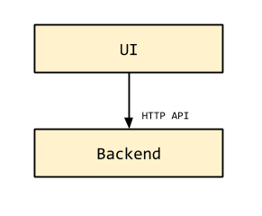

Testing a distributed system using API by Example
=================================================

This was the situation at Rockabox: we were starting to rebuild our monolithic
legacy system into a decoupled multi-service architecture. The new AngularJS
front-end talked to a series of backend services, some of which also talked to
each other. Most of this communication happened via synchronous HTTP API calls.

This is a very simplistic view of our system:

We were very happy about our improved build times, as we now could easily
build and test each service in isolation. But, these being the early days of
system building and many moving parts, we were often running into
situations where the UI was broken due to API changes in the backend that were
not properly tested against. The system was starting to mature and some of the
discussion was when and how to bring in system integration testing, but also
how to guarantee in the meantime that we could reliably test systems in
isolation and they were not breaking. Also because isolated service builds
were so much faster that we wanted to get the most value out of them.

In particular we needed a useful way to formalise the APIs of different
services in a way that we could use these specifications in tests at both ends
of the contract: the service provider and the service consumers.

The chosen testing approach in the service consumers was to mock the backend
responses. In the case of our Angular UI app, we use protractor for tests and
a mock http backend to emulate the backend services. We started writing these
tests locally in the UI repo, and hardcoding mocked responses for backend
services. This approach was a good starting point, but we needed a way to
prevent the mocks from going stale.

Backend-driven approach
-----------------------

Initially the team discussed this and we thought that the way forward would be
to write some scripts in the backend service that would regenerate responses
for a number of requests, and those responses would replace the contents of
the original mocks. This was to ensure that the mocks would not go stale, but
it had the downside that API changes had to be backend-driven, as the mocks
could only be generated by a working backend.

I didn't like the inefficiencies and potential blockages that it may enforce,
but what I disliked the most was the fact that this would not encourage us to
design an API before building and instead require us to potentially go
back-and-forth to ensure that the API was providing the most appropriate
response data that the UI needs.

API-driven approach
-------------------

So we came up with an alternative approach, which we called API-driven (in
contrast with the other approach, that we called backend-driven). In the
API-driven approach, the first code change we would do would be to create
a mock API request/response. This would get written and code-reviewed by at
least one backender (representing the API producer) and one frontender (the
consumer), to ensure the API was reasonable to implement and suitable.

To make this approach work, we defined a language-agnostic format to define
mock or sample request/response pairs. This format would be used to feed both
backend API tests and frontend UI tests (both Jasmine unit tests and protractor
functional tests).

Say hello to ABE.
-----------------

The API by Example format (ABE) aims to illustrate how an API works not by
having some formal API specification that can be processed by tools, but rather
using something much simpler which are real-world examples. These examples can
be used to feed test mocks, and eventually to generate human-readable API
documentation.

An ABE file defines an API endpoint by its URL, HTTP method, and one or more
sample request-response pairs. The purpose of including more than one examples
is to illustrate special cases of the API, such as error responses, cases
where the request returns an empty collection, just one object, many of them,
or variant representations.

The ABE format itself is a JSON file. We call it a language-agnostic mock
format, because with it you can easily create mocks in various languages or
for various testing libraries: we use Python and Javascript, but one could
easily write mocks for their language of choice.

The process of updating an API
------------------------------

The way we go about it at Rockabox, in its simpler form, involves 3 different
repos:

- One that includes the mock API samples - we'll call this one `mocks`
- The service provider - let's call it `backend`
- The service consumer - let's call it `UI`

Both `backend` and `UI` have an explicit dependency on the `mocks` repo, that
can be included either as a `bower` or a Python package (via `pip`).

This is how the setup looks like for service testing. Notice that UI testing
doesn't use the actual backend, Backend testing does not require the actual
frontend, and both share the same set of mocks:

Components in blue are out-of-the-box ABE utilities, and green ones are the
extra scaffolding that we need to write for our testing:

- `Mock backend`: initialised from within your protractor tests, uses
  `abe-protractor` for the setup.
- `mocks`: the shared collection of API samples
- `API tests`: in our case, Django API tests written in Python using the django
  testing framework. They use `abe-python` to parse ABE files and use them to
  feed the test API calls and to perform assertions on returned responses.
- `Factories`: (or fixtures) these are responsible for setting up the test data
  that will match the API sample expectation. E.g. if the API sample is for
  retrieving a collection of a resource, it will populate that collection in
  the backend.
